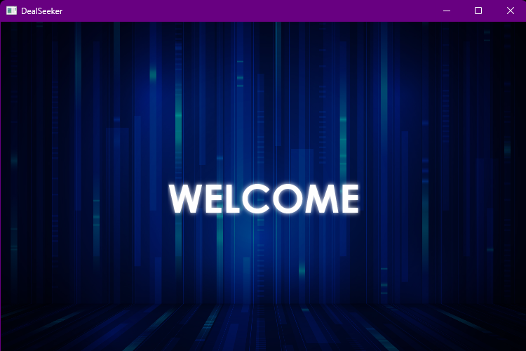
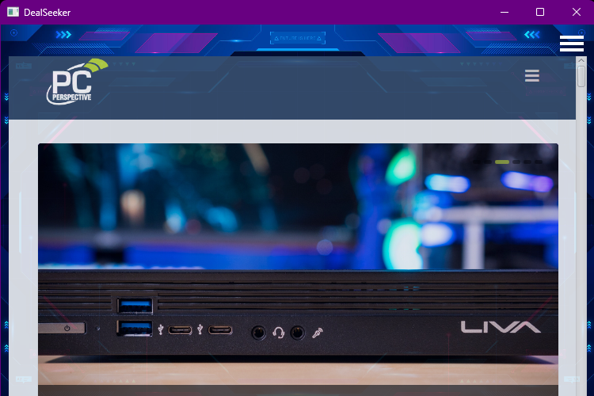
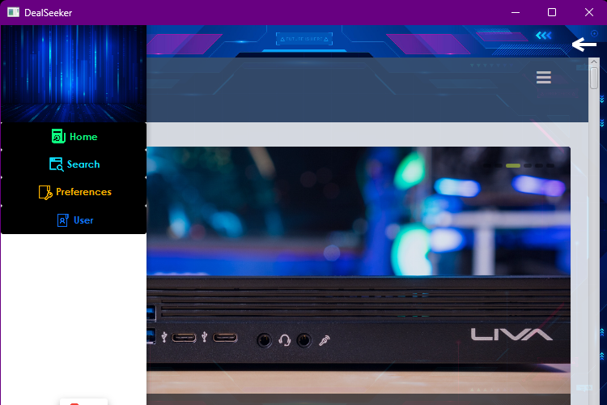
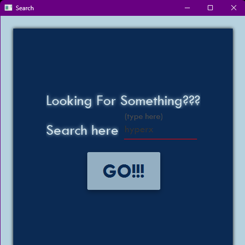
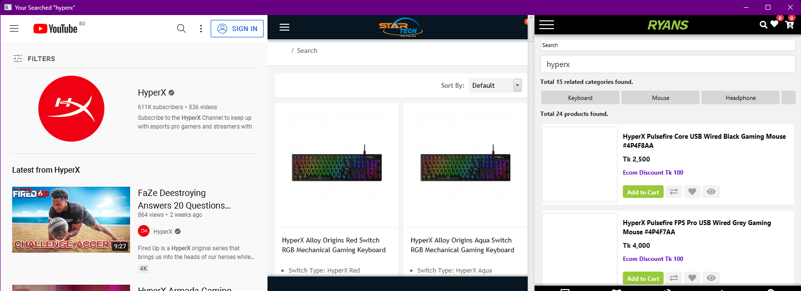
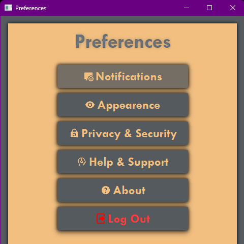
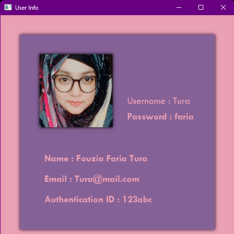

# DeelSeeker

Web Scraper in Java.

## Usage

- Get the latest version of IntelliJ

- Navigate to `src\MainStructure` folder 

```bash
cd src\MainStructure
```

- Run file

## Screenshots

### Splash Screen



### Main Menu



### Home



### Search



### Compare



### Preferences



### Users



## Connect With Me

[][website]

[][github]

[][instagram]

[][facebook]

[][twitter]

[][linkedin]

[github]: https://github.com/FouziaFaria
[website]: https://fouzia.bukharealsaif.com/
[facebook]: https://www.facebook.com/faria.alam.522
[twitter]: https://twitter.com/FouziaFariaTura
[instagram]: https://www.instagram.com/pandaria_228/
[linkedin]: https://www.linkedin.com/in/fouziafaria/
